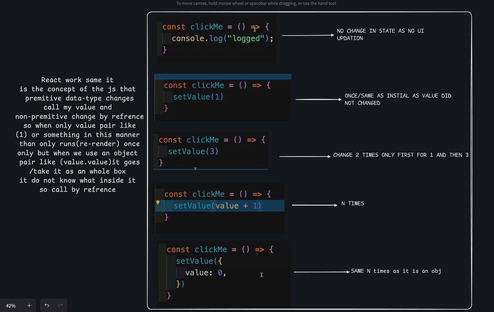

Here's the formatted `README.md` file:

```markdown
# React & JavaScript Concepts

## ❓ Why does a React component need to return a single root element?

✅ **Answer:**  
React components must return a single root element because the JSX returned from a component gets compiled into `React.createElement()` calls, and that function expects only one parent element to wrap all child elements. If multiple siblings are returned without a parent, it causes a syntax error.

✅ **Bonus Tip:**  
Instead of adding unnecessary `<div>`s, you can use React Fragments (`<>...</>`) to avoid adding extra nodes to the DOM:

```jsx
return (
  <>
    <h1>Title</h1>
    <p>Subtitle</p>
  </>
)
```

✅ **Simple Answer:**  
React needs everything inside one main wrapper because it can only return one thing from a component. If you try to return two separate tags side by side, React gets confused and gives an error.

---

## 🔄 React Component Lifecycle

```
        User Action (e.g., Button Click)
                    ↓
        Event Handler Function Runs (e.g., onClick → setState)
                    ↓
              State is Updated
                    ↓
          Component Re-renders (JSX re-evaluated)
                    ↓
          DOM is Updated (Visible Changes Applied)
                    ↓
          useEffect Cleanup Runs (if dependencies changed)
                    ↓
              New useEffect Runs
```

### React Component Lifecycle Diagram
```
+------------------------------------------------------+
|             🔄 React Component Lifecycle             |
+------------------------------------------------------+
|                                                      |
| 1. User triggers an event (e.g., button click)       |
|        ↓                                             |
| 2. Event handler runs (e.g., setState)               |
|        ↓                                             |
| 3. Component re-renders (function runs again)        |
|        ↓                                             |
| 4. Virtual DOM is updated                            |
|        ↓                                             |
| 5. React updates the actual DOM                      |
|        ↓                                             |
| 6. Previous useEffect cleanup runs (if needed)       |
|        ↓                                             |
| 7. New useEffect runs (after render)                 |
|                                                      |
+------------------------------------------------------+
```

### useEffect Lifecycle in React
```
+--------------------------------------------------------------+
|                  🔁 useEffect Lifecycle in React             |
+--------------------------------------------------------------+
|                                                              |
| 1. Component mounts                                          |
|    → useEffect runs **after** the initial render             |
|                                                              |
| 2. On re-render (due to state/prop change):                  |
|    → If dependencies changed:                                |
|       a. Previous useEffect cleanup runs                     |
|       b. Then new useEffect runs **after** DOM update        |
|                                                              |
| 3. If component unmounts:                                    |
|    → Cleanup function (if provided) runs                     |
|                                                              |
| ✅ useEffect runs:                                            |
|    - After DOM update                                        |
|    - On mount                                                |
|    - On dependency change                                    |
|    - Before unmount (cleanup)                                |
|                                                              |
+--------------------------------------------------------------+
```

---

## 🔄 JavaScript Event Loop

```
+----------------------------------------------------------+
|                    🔄 Event Loop                         |
+----------------------------------------------------------+
|                                                          |
| JavaScript is **single-threaded** — it runs 1 thing at a |
| time. But it can handle async tasks like setTimeout,     |
| fetch, etc., using the **Event Loop**.                   |
|                                                          |
| 🧠 Main Parts:                                            |
| 1. Call Stack – runs your code line by line              |
| 2. Web APIs – handles async things (timers, fetch, etc.) |
| 3. Callback Queue – stores completed async tasks         |
| 4. Event Loop – moves tasks from queue → call stack      |
|                                                          |
| 🔁 The Event Loop checks:                                 |
|    → Is call stack empty?                                |
|       ✅ Yes → take 1 task from queue → run it            |
|       ❌ No → wait                                        |
|                                                          |
| This is how JS stays non-blocking and fast.              |
+----------------------------------------------------------+
```

### Real Example: Event Loop
```
+------------------------------------------------------+
|            ⚙️ Real Example: Event Loop               |
+------------------------------------------------------+
|                                                      |
| ➤ Code:                                              |
|  +----------------------------------------------+    |
|  | console.log("1");                            |    |
|  | setTimeout(() => {                           |    |
|  |   console.log("2");                          |    |
|  | }, 0);                                       |    |
|  | console.log("3");                            |    |
|  +----------------------------------------------+    |
|                                                      |
| ➤ Output:                                            |
|  +----------------+                                  |
|  | 1              |                                  |
|  | 3              |                                  |
|  | 2              |                                  |
|  +----------------+                                  |
|                                                      |
| ✅ Explanation:                                      |
| - "1" prints first (sync)                            |
| - setTimeout is async, so it's delayed               |
| - "3" prints next                                    |
| - Then "2" runs via Event Loop                       |
+------------------------------------------------------+
```

### Event Loop Connections
| Concept            | Role in Event Loop                                   |
|--------------------|-----------------------------------------------------|
| Callback           | Goes to Callback Queue and waits for call stack to clear |
| setTimeout         | Timer finishes → callback queued → Event loop picks it |
| Promise            | `.then()`/`.catch()` go to Microtask Queue          |
| async/await        | Uses promises and microtasks behind the scenes      |
| Event Loop         | Controls when tasks from queues are run             |

---

## 🧩 Types of Functions in JavaScript

```
+---------------------------------------------------------------+
|             🧩 Types of Functions in JavaScript               |
+---------------------------------------------------------------+

| 📌 1. Function Declaration                                    |
|   +------------------------ Code --------------------------+ |
|   | function greet() {                                      | |
|   |   console.log("Hello");                                 | |
|   | }                                                       | |
|   | greet();                                                | |
|   +--------------------------------------------------------+ |
|   +------------------------ Output ------------------------+ |
|   | Hello                                                   | |
|   +--------------------------------------------------------+ |

| 📌 2. Function Expression                                     |
|   +------------------------ Code --------------------------+ |
|   | const greet = function() {                              | |
|   |   console.log("Hi");                                    | |
|   | };                                                      | |
|   | greet();                                                | |
|   +--------------------------------------------------------+ |
|   +------------------------ Output ------------------------+ |
|   | Hi                                                      | |
|   +--------------------------------------------------------+ |

| 📌 3. Arrow Function                                          |
|   +------------------------ Code --------------------------+ |
|   | const add = (a, b) => a + b;                            | |
|   | console.log(add(2, 3));                                 | |
|   +--------------------------------------------------------+ |
|   +------------------------ Output ------------------------+ |
|   | 5                                                       | |
|   +--------------------------------------------------------+ |

| 📌 4. Anonymous Function                                      |
|   +------------------------ Code --------------------------+ |
|   | setTimeout(function() {                                 | |
|   |   console.log("Delayed");                               | |
|   | }, 1000);                                               | |
|   +--------------------------------------------------------+ |
|   +------------------------ Output ------------------------+ |
|   | Delayed (after 1 sec)                                   | |
|   +--------------------------------------------------------+ |

| 📌 5. IIFE (Immediately Invoked Function Expression)         |
|   +------------------------ Code --------------------------+ |
|   | (function() {                                            | |
|   |   console.log("IIFE ran");                               | |
|   | })();                                                    | |
|   +--------------------------------------------------------+ |
|   +------------------------ Output ------------------------+ |
|   | IIFE ran                                                 | |
|   +--------------------------------------------------------+ |

| 📌 6. Callback Function                                       |
|   +------------------------ Code --------------------------+ |
|   | function greet(name, cb) {                               | |
|   |   cb(name);                                              | |
|   | }                                                        | |
|   | greet("Akshit", function(n) {                            | |
|   |   console.log("Hello " + n);                             | |
|   | });                                                      | |
|   +--------------------------------------------------------+ |
|   +------------------------ Output ------------------------+ |
|   | Hello Akshit                                             | |
|   +--------------------------------------------------------+ |
+---------------------------------------------------------------+
```

---

## ⏳ How Promises Work

```
+------------------------------------------------------+
|                   ⏳ How Promises Work               |
+------------------------------------------------------+
| A Promise is an object that represents an async task |
| that may:                                             |
|   - ✅ Resolve (Success)                              |
|   - ❌ Reject (Failure)                               |
|                                                      |
| States:                                               |
| 1. Pending → 2. Fulfilled / Rejected                 |
|                                                      |
| Usage:                                                |
| const promise = new Promise((resolve, reject) => {   |
|     async work here                                  |
|     resolve("Done!") / reject("Error")               |
| });                                                   |
|                                                      |
| promise.then(result).catch(error);                   |
|                                                      |
| 📌 Promises go to Microtask Queue after resolve/reject|
+------------------------------------------------------+
```

---

## 🔁 How async/await Works

```
+------------------------------------------------------+
|                 🔁 How async/await Works             |
+------------------------------------------------------+
| async/await is a cleaner way to use Promises         |
|                                                      |
| - `async` marks a function to return a Promise       |
| - `await` pauses the function until Promise resolves |
|                                                      |
| Example:                                              |
| async function fetchData() {                         |
|   const res = await fetch("url");                    |
|   const data = await res.json();                     |
|   console.log(data);                                 |
| }                                                    |
|                                                      |
| 📌 Inside, it's still using Promises & Microtasks    |
| 📌 Errors are handled with try...catch               |
+------------------------------------------------------+
```

---

## 🔁 Currying in JavaScript

```
+---------------------------------------------------------------+
|                      🔁 Currying in JavaScript                |
+---------------------------------------------------------------+

| 💡 Currying is a technique of breaking a function             |
|    with multiple arguments into a series of functions         |
|    that take one argument at a time.                          |

| 💻 Code:                                                      |
|   +------------------------ Code --------------------------+ |
|   | function multiply(a) {                                  | |
|   |   return function(b) {                                  | |
|   |     return a * b;                                       | |
|   |   };                                                    | |
|   | }                                                       | |
|   | const double = multiply(2);                             | |
|   | console.log(double(5));                                 | |
|   +--------------------------------------------------------+ |

| 📤 Output:                                                    |
|   +------------------------ Output ------------------------+ |
|   | 10                                                       | |
|   +--------------------------------------------------------+ |

| ✅ Explanation:                                               |
|   - `multiply(2)` returns a new function                     |
|   - That function remembers `a = 2` and takes `b = 5`        |
|   - Returns 2 * 5 = 10                                       |
+---------------------------------------------------------------+
```

---

## 🔒 Closures in JavaScript

```
+---------------------------------------------------------------+
|                     🔒 Closures in JavaScript                 |
+---------------------------------------------------------------+

| 💡 A closure is when a function "remembers" the               |
|    variables from its lexical scope even after the outer     |
|    function has finished execution.                          |

| 💻 Code:                                                      |
|   +------------------------ Code --------------------------+ |
|   | function outer() {                                      | |
|   |   let counter = 0;                                      | |
|   |   return function inner() {                             | |
|   |     counter++;                                          | |
|   |     console.log(counter);                               | |
|   |   };                                                    | |
|   | }                                                       | |
|   | const count = outer();                                  | |
|   | count();  count();  count();                            | |
|   +--------------------------------------------------------+ |

| 📤 Output:                                                    |
|   +------------------------ Output ------------------------+ |
|   | 1                                                       | |
|   | 2                                                       | |
|   | 3                                                       | |
|   +--------------------------------------------------------+ |

| ✅ Explanation:                                               |
|   - `inner()` remembers `counter` from `outer()`             |
|   - Even after `outer()` is done, `counter` lives on         |
|   - This is a **closure**                                    |
+---------------------------------------------------------------+
```

